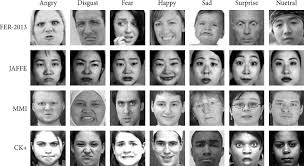

# Facial-Detection-Expression-Classification

Facial emotion is a significant factor involved in human communication that helps one understand the intentions of others.One can find its practical importance in many industries like medical treatment, security surveillance, entertainment, etc. The aim of this project is to build a multi-class classifier by implementing a general convolutional neural network (CNN) in TensorFlow and building its architecture in a way as to achieve the detection of a face in the image clicked live by a webcam and classification of facial patterns, specifically changes in moods or expressions and classify each image into one of seven universal facial emotion classes. It can be run on various different operating systems by the click of a very basic keys – spacebar and esc.

The dataset chosen as the base model to analyse the configuration and perform subsequent analysis needed to identify and map a face, in the form of individual pixels rendered by an image is FER2013. This is a large-scale, unconstrained database collected by the Google image search API and consists of grayscale images of faces of size 48x48 pixel in the csv format. The Kaggle version (used in this project) of the dataset includes a train and test set. The faces have been automatically registered in order to centre the face accurately and occupies about the exact same amount of space in every image.
Dimension of ‘train.csv’ is 28,709 rows of image data in the form of pixels.

The task at hand is to correctly identify a single expression for every face by the emotion present on the face. Both, ‘train.csv’ and ‘train.csv’ consists of two features out of the rest, "emotion" and "pixels".
The "emotion" column consists of a numeral between 0 and 6 representing the emotion of that image. The "pixels" column consists of a string. The string is a pixel value in row major order. The test set, ‘test.csv’ contains only the "pixels" column and the task at hand is to predict the emotion column.

The entire code is based on the facial expression of the image that is clicked live by the person accessing the code through their system’s webcam. Once the last command of ‘display’ function is run, the webcam opens and using SPACEBAR, one can click the photo and close the webcam by pressing ESC. The result is immediately produced and displayed. Also, the permissions of the system determine the webcam’s productivity. Some operating systems would create an issue but that can be resolved by changing the underlying security constraints to experience the full effect the said algorithm.

A Convolutional Neural Network (CNN) consists of single or multiple convolutional layers mostly with stages of subsampling which is followed by more single or fully connected layers which are linearly stacked making it have a deep architecture but in general, it remains a multilayer neural network. CNN’s architecture is constructed to take advantage of the input which is a two-dimensional image or could even be a speech signal which is two- dimensional. Now, this is possible by having local receptive connections with weights tied to them and then have pooling performed on this arrangement so that the result is that of features that don’t vary as much.
Another advantage of this algorithm is that they are relatively simpler to train and have a smaller number of parameters when compared to a fully connected network while having equal number of hidden segments. In this paper, the architecture of a convolutional neural network is discussed and the back-propagation algorithm to compute the gradient with respect to the parameters of the model to use gradient based optimization.

For the application of the recognition of a face in real-time, we used the pre-trained HAAR Cascade with OpenCV3 to implement the real time facial expression recognition. (main program implemented in cnn_modeltry.h5py) After the HAAR Cascade identify the location of the face, the program crops out the area of the face and reshapes it to (100x100x3) and feeds it to Keras model.

The plan to implement the adequate form of neural network and feed training data to it to observe its performance to detect if a particular image has a face and then determining its emotion has been implemented. The model was finetuned in such a manner that it can be used on any image to determine the emotion and get a good accuracy. A prototype  program was constructed of real time facial expression recognition to make the outcome of this project more practical instead of just comparing the accuracy and loss.
